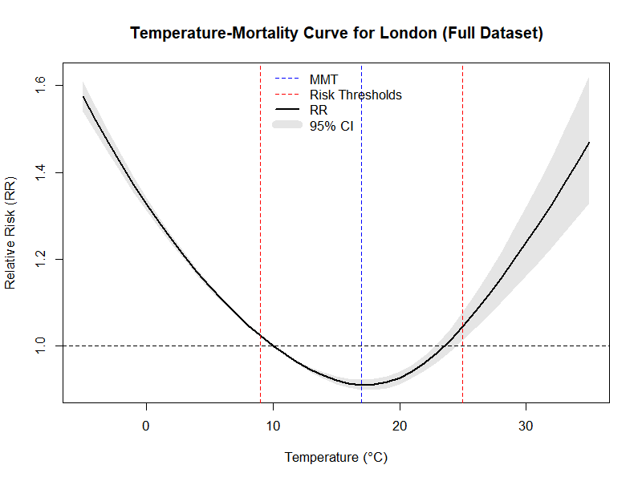
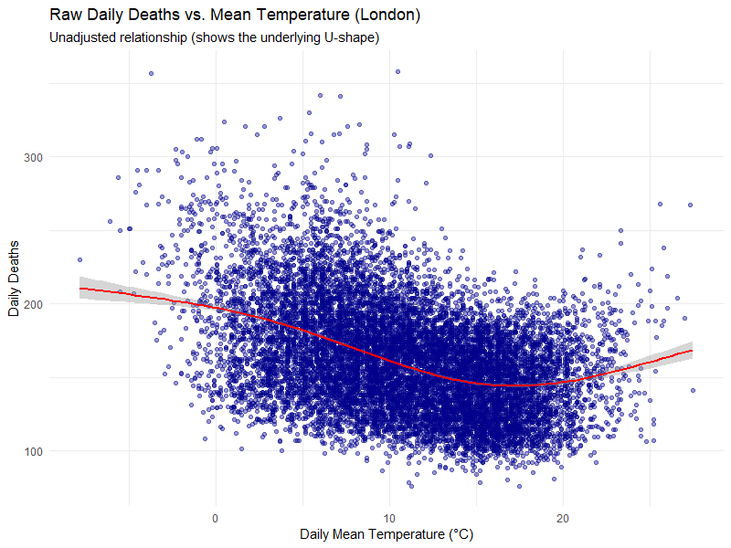
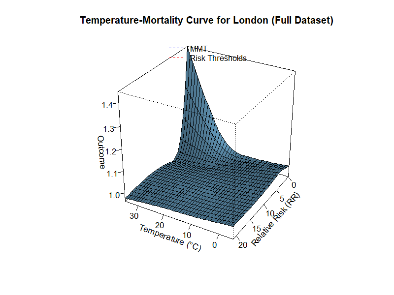

# fall-2025-extreme-temperatures-and-public-health

We investigate the effects of short periods of extreme weather on public health across 10 different UK regions (1981–2022).

## Background

Short bursts of hot and cold weather can affect a person's health, particularly the elderly and young. In turn, this can stress health systems and increase mortality. These effects vary by season, region, and population. This project links weekly deaths to weekly weather anomalies in order to quantify the effect of extreme weather and predict the implications of a potential changes to the climate.

## Problem Statement

We measure how weeks of unusually hot or cold weather shift mortality relative to expected baselines, by region, while controlling for long-term trends and seasonality.

## Objectives

* Build population-adjusted weekly excess mortality rates for each region.
* Estimate short-term effects of heat and cold on mortality.
* Assess the impact of extreme weather based on e.g. region and age group.
* Produce simple indicators that can pair with forecasts for surge planning.

## KPIs

* Accuracy of excess mortality estimates on unseen historical weeks.
* Consistency of effect direction/magnitude across regions and age groups.
* Clarity and usefulness of stakeholder facing summaries.
* Reproducibility of data processing and modelling.

## Stakeholders

Public health agencies, emergency planners, health services, local authorities and UK residents.

## Project Setup

## Data

* Mortality: ONS (Office for National Statistics) weekly deaths by age and region (https://www.ons.gov.uk/peoplepopulationandcommunity/birthsdeathsandmarriages/deaths/adhocs/1125weeklydeathoccurrencesbysexfiveyearagegroupandregionenglandandwales1981to2021).
* Weather: Historical daily weather (e.g., temperature, humidity, precipitation) for the largest city/cities in each region (www.visualcrossing.com).
* 2020 and onwards was excluded from our study due to the difficulty of modelling the effects of the Covid-19 pandemic.

Temperature data for the region of London:

An age breakdown of weekly deaths for all regions:

## Repository Structure

* /HealthData
  * Weekly_deaths_by_age_and_region_1981_2022 (primary dataset)
* /Weather_Data
  * Daily weather for largest city/cities in each region. This is taken to represent the weather for that whole region.
* /PreliminaryDataExploration
  * An initial look at the data to generate some feel for the data
* /BasicModelling
  * Modelling the data with a simply polynomial, assessing only the impact of temperature
* /PyTorchModellingAndPredictions/CNN_Modelling_deseasonalised/
  * A CNN model, trained on the weekly data for weather and excess deaths
* labelled_regions_map.png
  * A map of the 10 different regions (Scotland labeled but excluded from the government statistics)
## Approach

Baseline Processing:

* We identify a seasonal trend, with a yearly peak in winter and dip in summer. This corresponds largely to the seasonal flu.
* We remove the seasonal effects from the data with LOESS-smoothed trend fitting. This then highlights the impact of shorter term weather effects.
* We roughly define 'extreme temperatures' as being daily maximums outside the range of 8-21 degrees celsius. This is when an increase in deaths above the seasonal baseline is seen.

Weekly excess deaths versus temperature for the region of the West Midlands:

### Simple modelling and projections:

* In /Data/BasicModeling/deaths_vs_temperature/region_breakdown, we show a simple second order polynomial fit to the data, looking only at the impact of the mean of the week's 7 daily maximum temperatures on excess deaths. This fit is motivated by the appearance of the data, rather than an expected or predicted relationship (which is likely extremely complex). This shows a rise in deaths during the hottest and coldest weeks.

* We also looked at a breakdown by region and age. However, we find that breaking the data down into this granularity leaves only a weak signal with a high level of noise. We therefore proceed with our modelling using a regional breakdown only.

### Machine Learning Modelling

Although temperature is likely to have the most significant effect of all the weather variables, other factors such as precipitation and snowfall are likely to play a role e.g. through car accidents or slips on ice. We therefore chose to adopt a ML approach which could simultaneously account for these multiple factors.

We model the weekly excess deaths for each region as a function of weekly aggregated weather features. The end-to-end pipeline is scripted and reproducible:

* **Data prep.** We merge ONS weekly deaths with weekly means of daily weather (e.g., tempmax, humidity, windspeed). Deaths are detrended with a LOESS smoother to remove long-run and seasonal structure before modelling. Output: `region_weather_vs_excess_deaths.csv`. 
* **Per-region splits.** For each region we create train/test CSVs (80/20, seeded) and quick diagnostics plots of `tempmax` vs. excess deaths. 
* **Model.** A CNN (64->32->1 with ReLU + dropout) is trained separately per region on up to six features: `tempmax, tempmin, snowdepth, humidity, windspeed, precipitation`. The collection of features used can be adjusted. We find the combination of `tempmax, tempmin, snowdepth, humidity` gives the best results. Training uses Adam, mini-batches, input Gaussian noise to augment the training data (sigma=0.05), dropout (p=0.10), and early stopping. We save `model.pt` and `preprocess.npz` (feature order and scaling). 
* **Test-time inference & plots.** For each region we reload the saved scaler + model to predict on the test data set, exported to `test_temp_pred_actual.csv` plus scatter/histogram figures comparing predicted vs. actual excess deaths against `tempmax`. 
* **Demonstration of use.** As a demonstration, using monthly median weather for June/December (1981–2019) we show how +/-5°C shifts in `tempmax` affect the model’s implied change in monthly deaths. A weather forecast could equally be used to predict upcoming excess deaths, or a climate model based forecast for determining longer tends.
* **One-click run.** `0_run_modelling.py` executes all steps associated with this modelling (files beginning 1_ to 9_) in order. 

### Validation

We evaluate the prediction quality of our model on the unseen test data, and probe for systematic errors.

* **Train/test protocol.** Within each region, rows are randomly split 80/20 into train/test data. The test data is never seen until validation of the model.
* **Primary metrics (per region + TOTAL).** We report R^2, RMSE, MAE, NMSE, and a pseudo-R^2. We also benchmark against a zero baseline (predict 0 excess deaths), reporting RMSE of that baseline and % improvement vs. zero. A summary CSV with regional rows, plus a concatenated total row, is saved as metrics_summary.csv. 
* For each region we save:

  * **Prediction vs. truth** scatter/histogram (`temp_vs_actual_and_pred_TEST.png`) and predictions-only (`temp_vs_pred_ONLY_TEST.png`). 
  * **Residual structure checks.** We plot `(prediction − actual)` against `tempmax` and overlay 1,000 bootstrapped linear fits to estimate the mean slope +/-sd. A slope near 0 indicates no linear residual bias with respect to temperature. 
  * **Nonlinearity check.** We repeat with 1,000 bootstrapped quadratic fits and display the mean +/-sd of the linear and quadratic coefficients to detect curvature in residuals. 

| Region | Split |   Rows |    R**2(1) |    MAE |  NMSE | Beats Zero |
| ------ | ----- | -----: | ----: | -----: | ----: | :--------: |
| All combined  | Train | 16,280 | 0.044 | 29.54 | 0.956 |     Yes    |
| All combined  | Test  |  4,070 | 0.029 | 29.43 | 0.971 |     Yes    |

(1)R^2 is low for the data after the removal of the seasonal trend (which is largely due to winter flu). Without this removal (see /Data/PyTorchModellingAndPredictions/CNN_Modelling_not_deseasonalised) R^2 is much higher, with a value of 0.89 on test data.

For one region's test data, below we show the predicted excess deaths versus the true excess deaths for the model as trained on `tempmax, tempmin, snowdepth, humidity`.

Demonstration of use: Using monthly median weather for June/December (1981–2019) we show how shifts in `tempmax` affect the model’s implied change in monthly deaths. A weather forecast could equally be used to predict upcoming excess deaths, or a climate model based forecast for determining longer tends.

*Interpretation:*
We find an R^2 near 0 and consistent (but minimal) improvement vs. the zero baseline. This implies that short term weekly variability in excess deaths is dominated by noise and/or unmodelled factors i.e. non-weather factors. Non-zero slopes or curvature in the residual vs temperature plots would signal missed features. However, the flat residual trends we find suggest the ML model has captured what little signal exists in the data.

## Simple versus complex model comparison
We assess the predictive capability of our ML model compared with a simple second order polynomial fit to the data, looking solely at the relationship between temperature and excess deaths. For all combined regions, on the test data we find:

| ----: |    RMSE (deaths) |  MAE (deaths) |
| ----: | -----: | ----: |
| ML model | 47.38 | 29.43 |
| Second order polynomial  | 47.36  | 29.54 |

These data are in `PyTorch_model_fit_metrics_summary.csv` and `simple_polynimial_fit_metrics_summary.csv`. Ultimately, they show little to no improvement from the more complex model.

## Time-lag effects

In the analysis above, we have only considered the contemporaneous impacts of the weather. Close to the end of the project, we also decided to investigate the potential of delayed impacts i.e. extreme weather events causing excess deaths in subsequent weeks. To study those effects we used the **Distributed Lag Non-linear Model (DLNM)** model through a package in R. We give a summary of the model and the results below: 

## Overview: Modeling Temperature-Mortality using Distributed Lag Non-linear Model (DLNM)

This approach uses a standard epidemiological method to analyze the complex relationship between daily temperature and public health. The goal is **not to predict** future deaths, but to **explain** the historical, underlying relationship.

The primary goal is to answer these questions:
1.  What is the **Minimum Mortality Temperature (MMT)**, the "safest" temperature for London?
2.  What is the "U-shaped" curve of risk? (i.e., how much does risk increase as it gets hotter or colder?)
3.  What are the "cutoff" thresholds where heat and cold become statistically significant public health threats? That is, when the Relative Risk (RR) rises above 1.

## a. The Statistical Model

The model we are using is a **Poisson Generalized Linear Model (GLM)**.

* **GLM:** This is the "parent" model. We use it because our outcome (`deaths`) is a "count" (a non-negative integer), not a continuous number like a stock price.
* **Poisson:** This is the specific type of GLM for count data. It models the *logarithm* of the expected number of deaths.

The main challenge is that the effect of temperature is complex. To handle this, we add a sophisticated component called a **Distributed Lag Non-linear Model (DLNM)**.

The DLNM is designed to solve two problems at once:
1.  **Non-linear (U-Shape):** The relationship isn't a straight line. Risk is low at a "safe" temperature and increases for *both* cold and heat. We use a **spline** to let the model "find" this U-shape.
2.  **Distributed Lag (Delayed Effect):** The health impact of a temperature spike isn't just immediate. Heat effects can be delayed by 1-3 days, and cold effects can be delayed for *weeks* (e.g., a cold snap leading to pneumonia 10 days later). The DLNM captures this delayed effect over a 21-day "lag" window.

---

## b. The Model Formula
In the R code we use the following formula for the number of deaths: 
deaths ~ cb_temp + ns(time, df = 15) + ns(doy, df = 12) + as.factor(dow)
This is equivalant to the conceptual model:

$$Log(E[Deaths_t]) = \alpha + f(Temp_t, \text{lag}) + s(\text{time}) + s(\text{doy}) + \beta(\text{dow})$$

Where each component means:

* **$Log(E[Deaths_t])$**: The **Logarithm of the Expected Deaths** on a given day, $t$. This is our outcome.
* **$\alpha$ (alpha)**: The **Intercept**, or the baseline average log-death rate when all other variables are zero.
* **$f(Temp_t, \text{lag})$**: This is the **DLNM component**, which your code calls `cb_temp`. This is the most important term. It's a 3D "surface" that represents the complex, lagged, and non-linear effect of temperature.
* **$s(\text{time})$**: This is a **Confounder** for **Long-Term Trends**. Your code uses `ns(time, ...)`. This is a smooth line (a spline) that "soaks up" the effect of things like improving healthcare, declining smoking rates, or population growth over the 30-year period.
* **$s(\text{doy})$**: This is a **Confounder** for **Seasonality**. Your code uses `ns(doy, ...)`. This is a smooth function of the "day of year" (1-365) that "soaks up" all seasonal effects that *aren't* temperature, like the flu season, holidays, or changes in air pollution.
* **$\beta(\text{dow})$**: This is a **Confounder** for **Day of Week**. Your code uses `as.factor(dow)`. This accounts for administrative artifacts, such as death reporting delays over the weekend.

By including the confounders, we can be more confident that the `cb_temp` term is isolating the *true* effect of temperature alone.

## c. Results & Key Findings of the DLNM approach

The model was successfully fitted to the entire 30-year dataset (1985-2014) for different regions in the UK. The primary findings are divided into the epidemiological results (the goal of the study) and the model's overall fit. Following are the results for London:

### Epidemiological Findings

The main goal was to identify the temperature-mortality relationship, which is best summarized by the following points:

* **Minimum Mortality Temperature (MMT): 17°C**
    * The model identified 17°C as the "safest" temperature for London, where the relative risk of mortality is at its absolute minimum.

* **Temperature Risk Thresholds:**
    * **Cold Threshold: 9°C**
    * **Heat Threshold: 25°C**
    * These thresholds define the "safe" temperature band. The model found that once the temperature drops to **9°C or below**, or rises to **25°C or above**, the mortality risk becomes statistically significant (with 95% confidence).

This core result is visualized in the output file `dlnm_rr_curve_2D.png`, which shows the U-shaped relative risk curve.

### Model Fit Metrics

These metrics evaluate how well the *entire* model (temperature + confounders) explains the variance in the original data.

* **R² = 0.814** (or 81.4%)
    * This indicates a very strong fit. The model (including temperature, long-term trends, and seasonality) successfully explains **81.4% of the daily variance in deaths**.

* **MAE = 11.91**
    * The **Mean Absolute Error** shows that, on an average day, the model's prediction of the death count was off by approximately **12 deaths**. Given the daily fluctuations, this represents a high degree of accuracy.
 
### Results For All Regions

### Final Results Summary (All Regions)

| Region | R² (Model Fit) | MMT (°C) | Cold Threshold (°C) | Heat Threshold (°C) |
| :--- | :--- | :--- | :--- | :--- |
| **London** | 81.6% | 18°C | 9°C | 24°C |
| **South East** | 65.3% | 19°C | 9°C | 26°C |
| **West Midlands** | 59.7% | 19°C | 9°C | 27°C |
| **East of England** | 56.7% | 19°C | 9°C | 29°C |
| **East Midlands** | 52.7% | 19°C | 9°C | 30°C |
| **Yorkshire & Humber**| 63.1% | 20°C | 9°C | **NA** |
| **South West** | 55.7% | 20°C | 9°C | **NA** |
| **North West** | 71.7% | 21°C | 9°C | **NA** |
| **North East** | 52.7% | 27°C | 9°C | **NA** |
> **A Note on `NA` Results:**
>
> An `NA` in the **Heat Threshold** column is not an error. It is a key finding. It indicates that the model did not find a statistically significant mortality risk from heat for that region.
>
> This happens because the 95% confidence interval (the grey "error bar" on the plot) was too wide and never fully rose above the 1.0 relative risk line. This results in a "J-shaped" curve, which suggests that only cold weather poses a significant, measurable threat to public health in that region.
 
### Diagnostic & Output Plots

* **Main Result (`dlnm_rr_curve_2D.png`):** This is the **primary result** of the analysis. It's the 2D "U-shaped" plot showing the *adjusted* risk of temperature after all confounders have been removed. It is used to find the MMT and thresholds.

  
    

* **Raw Data Check (`raw_deaths_vs_temp_scatter.png`):** This `ggplot` scatter plot is a simple diagnostic tool showing the *unadjusted* relationship between daily deaths and temperature. Its U-shape is different from the main result because it still includes the effects of seasonality (e.g., flu season).

  

* **3D Risk Surface (`dlnm_rr_curve.png`):** This 3D plot is the default output from `dlnm`. It visualizes the full risk model, showing **Temperature** (x-axis), **Lag (days)** (y-axis), and **Relative Risk** (z-axis). It is useful for seeing *when* the risk occurs (e.g., the peak of heat risk at 2-3 days).

  

## 5. Conclusions & Key Insights

This analysis successfully modeled the temperature-mortality relationship across all 9 regions of England using an adaptive methodology. The results reveal clear, actionable patterns in public health vulnerability.

### Overall Conclusions

1.  **Cold is a Universal & Consistent Risk:** The most striking finding is the consistency of the cold effect. **Every single one of the 9 regions** showed a statistically significant **Cold Threshold of 9°C**.

2.  **Heat Risk is Highly Regional, Not National:** The effect of heat is *not* one-size-fits-all. The analysis revealed two distinct groups in England:
    * **Heat-Vulnerable:** 5 regions (primarily in the South and Midlands) showed a statistically significant heat effect.
    * **Heat-Resilient:** 4 regions (primarily in the North and South West) showed **no statistically significant risk from heat** (`Heat Threshold: NA`).
    * This implies that public health policies for heat (like heatwave warnings and cooling centers) should be targeted specifically at vulnerable regions rather than applied nationally.

3.  **The Model is a Strong Explanatory Tool:** The R² values (ranging from 52% to 82%) confirm that the model (temperature + seasonality + long-term trends) is a robust tool for explaining the majority of the variance in daily deaths across England.

---

### Region-Specific Insights

The 9 regions clearly fall into two categories, defined by the *shape* of their mortality curve.

#### Group 1: "U-Shape" Regions (Heat & Cold Vulnerable)
These regions show a classic **U-shaped curve**, where both high and low temperatures lead to a significant increase in mortality.

* **London:** (MMT: 18°C, Cold: 9°C, Heat: 24°C)
    London is the most vulnerable region, especially to heat. It has the lowest MMT (18°C) and the lowest heat threshold (24°C). This is a classic signature of an **Urban Heat Island (UHI)** effect, where the dense urban environment amplifies heat and increases population vulnerability.

* **South East, West Midlands, East of England, East Midlands:**
    This group forms the rest of the heat-vulnerable cluster. Their MMTs are consistently around 19°C, and their heat thresholds are clustered in the high 20s (26°C - 30°C).

#### Group 2: "J-Shape" Regions (Cold Vulnerable Only)
These regions show a **J-shaped curve**, where risk significantly increases with cold, but flattens out or does not significantly rise with heat.

* **North West, Yorkshire & Humber, South West:**
    These regions all show a very similar pattern: a "safe" temperature (MMT) around 20-21°C, a clear cold threshold at 9°C, and **no statistically significant heat effect**. This suggests their populations are well-adapted to the high temperatures they normally experience.

* **North East:** (MMT: 27°C, Cold: 9°C, Heat: NA)
    This is the most extreme example of a J-shaped curve. The model found the "safest" temperature to be 27°C, meaning the risk curve is essentially flat for all warm and hot temperatures. This is a very strong finding that for the North East, only cold weather poses a significant, measurable threat to public health.

## Conclusions and Future Implications

* Periods of extreme heat and cold have a tangible effect of public health. They cause an increase in excess deaths.
* However, this effect is smaller than the random fluctuations (noise) is the weekly deaths data.
* Our models are therefore unlikely to be useful in predicting the need for surge planning, as was initially envisioned.
* A brief but incomplete look at time lag effects near the end of the project appears to show promising results and may improve the predictive power of our model.
* Our models are likely more suited to predicting longer term effects e.g. how a long period of warm weather or climate change will affect public health in the long term.

## References

* Relevant epidemiology/climate-health literature with a different approach, but similar findings: https://www.thelancet.com/journals/lancet/article/PIIS0140-6736(14)62114-0/fulltext

## Team Members

This project has been developed for the Fall 2025 Erdös Institute Data Science Boot Camp by:

* Tom Rose
* Sunit Patil
